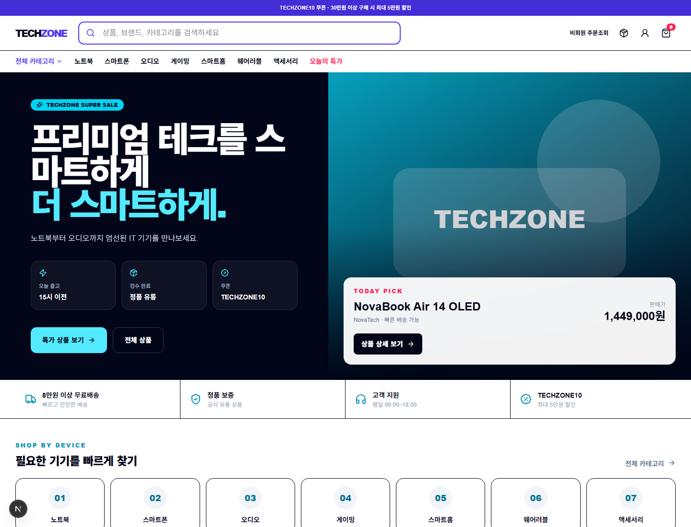
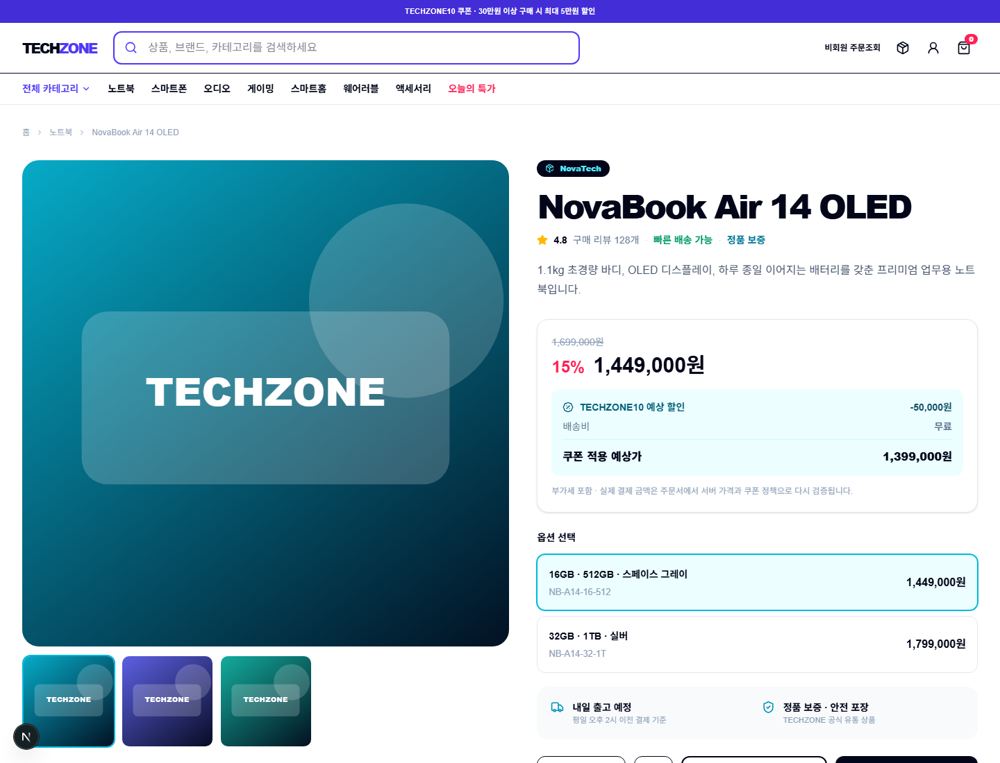
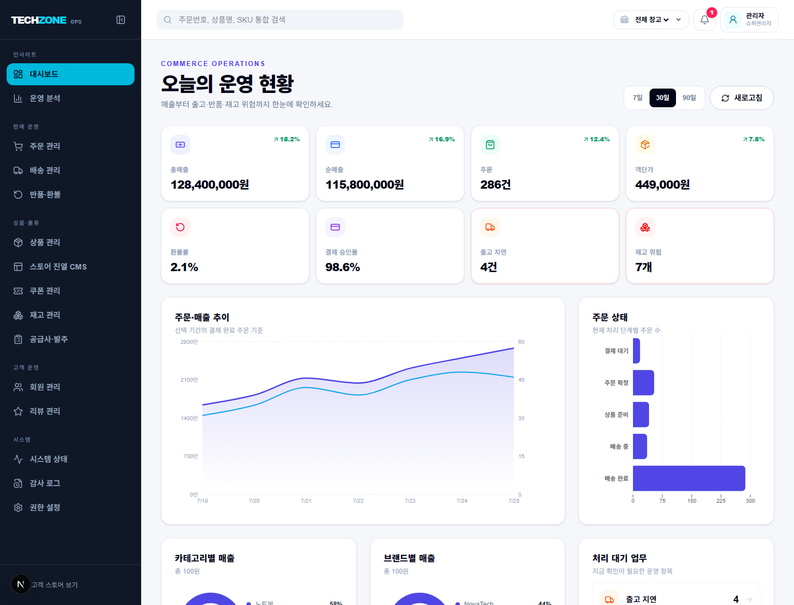
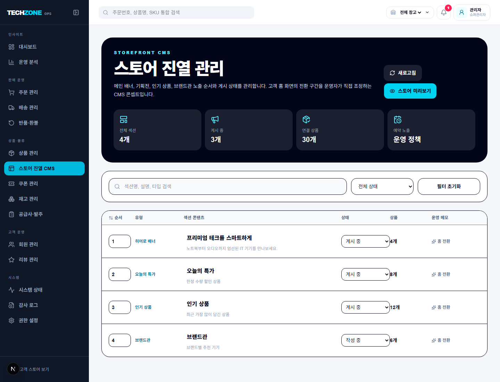
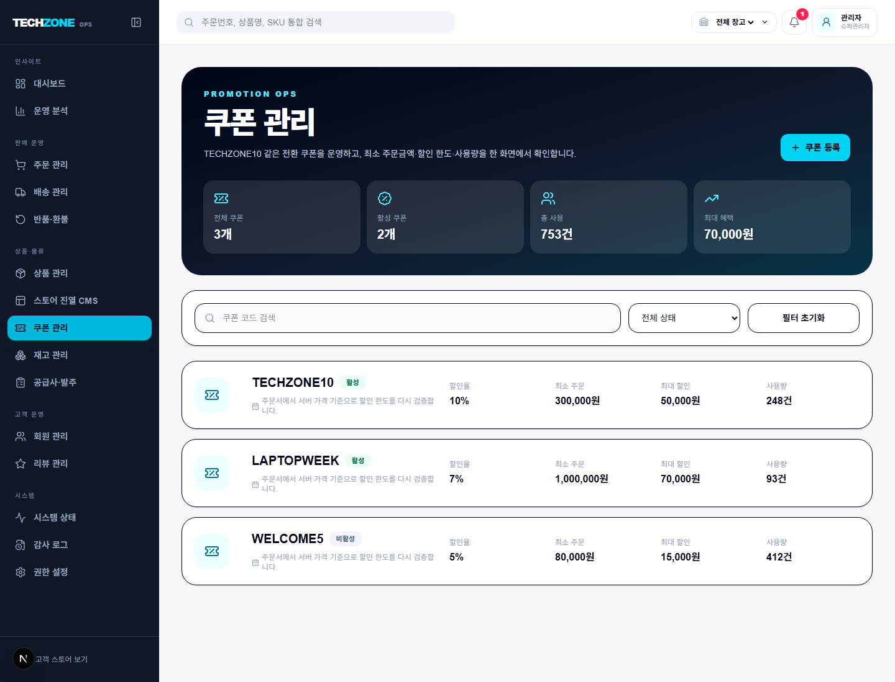
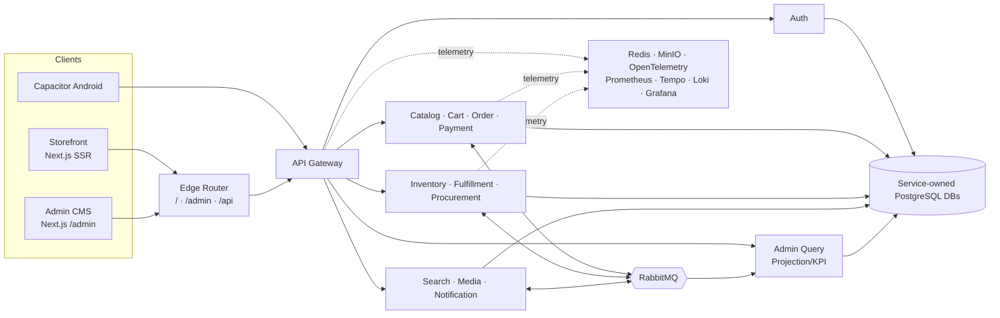

# TECHZONE

[](https://github.com/lulupang2/ecommerce/actions/workflows/ci.yml)

TECHZONE은 테크·IT 기기 쇼핑몰을 주제로 만든 포트폴리오용 상용형 커머스 플랫폼입니다. 고객 스토어, 관리자 OMS/WMS, NestJS 기반 MSA, 이벤트 신뢰성, Docker/Kubernetes 배포 예시까지 한 흐름으로 보여주는 것을 목표로 합니다.

> 처음 보는 경우 [Case Study](docs/CASE_STUDY.md) → [시연 시나리오](docs/DEMO.md) →
> [아키텍처](docs/ARCHITECTURE.md) 순서로 읽으면 제품과 기술 선택을 빠르게
> 파악할 수 있습니다.

## 무엇을 보여주는 프로젝트인가

- 고객은 Next.js SSR 스토어에서 상품 탐색, 상세 비교, 장바구니, 쿠폰, Mock 결제, 주문 조회, 취소·반품 요청을 경험합니다.
- 운영자는 관리자 CMS에서 대시보드, 주문, 배송, 반품, 상품, 재고, 발주, 회원, 리뷰, 쿠폰, 홈 진열, 권한, 감사 로그를 관리합니다.
- 백엔드는 서비스별 DB 소유권, Drizzle ORM, RabbitMQ 이벤트, outbox/inbox, 멱등성, DLQ, projection을 통해 MSA 운영 흐름을 시연합니다.
- 웹과 Capacitor Android 앱은 같은 고객 컴포넌트를 공유하고, 관리자는 별도 Next.js 앱으로 `/admin` 경로를 유지합니다.

## 해결한 핵심 문제

| 문제 | 선택 | 검증 근거 |
| --- | --- | --- |
| 옵션별 가격·재고·출고 SKU 불일치 | Product와 Variant를 분리하고 주문·재고의 기준을 Variant로 통일 | 서버 quote, 재고 reservation·movement 통합 테스트 |
| DB commit과 RabbitMQ publish 사이의 이벤트 유실 | Transactional outbox, publisher confirm, inbox event ID | RabbitMQ 중단·복구 resilience 테스트 |
| 관리자 대시보드의 서비스 간 fan-out | Admin Query가 이벤트 기반 projection과 KPI 제공 | projection rebuild와 원본 합계 검증 |
| 웹 SEO와 Android 코드 중복 | Next.js SSR과 Capacitor 정적 export가 고객 화면 공유 | SSR build, static build·sync, Android APK |
| 공개 배포 실패와 데이터 손상 | 불변 릴리스, 배포 전 DB backup, HTTPS smoke, 자동 직전 버전 복구 | 배포 셸·Compose 계약과 공개 surface 검사 |

## 핵심 데모 시나리오

1. 고객 홈에서 CMS 기반 히어로·기획전·인기 상품을 확인합니다.
2. 상품 목록에서 카테고리, 브랜드, 가격, 재고 필터와 정렬을 사용합니다.
3. 상품 상세에서 variant, 쿠폰 예상가, 배송 안내, 리뷰, Q&A, 찜을 확인합니다.
4. 장바구니에서 무료배송 진행률과 서버 가격 검증 안내를 확인하고 주문서로 이동합니다.
5. 주문서에서 `TECHZONE10` 쿠폰과 Mock 결제를 사용해 주문을 생성합니다.
6. 마이페이지 또는 비회원 주문조회에서 주문 타임라인, 배송 상태, 취소·반품 가능 정책을 확인합니다.
7. 관리자에서 주문 상태 변경, 배송 처리, 반품·환불, 재고 조정, 상품 등록, CMS 진열, 쿠폰 운영을 확인합니다.
8. Grafana와 CI에서 서비스 healthcheck, 통합 테스트, resilience 테스트 결과를 확인합니다.

## 화면 미리보기

아래 이미지는 `npm run demo:screenshots`로 재생성할 수 있습니다. Playwright가 API 응답을 mock해 백엔드 전체를 띄우지 않아도 포트폴리오 핵심 화면을 캡처합니다.

| 고객 홈 | 고객 상품 상세 | 관리자 대시보드 |
| --- | --- | --- |
|  |  |  |

| 관리자 스토어 CMS | 관리자 쿠폰 운영 |
| --- | --- |
|  |  |

## 구현 범위

| 영역 | 구현 내용 |
| --- | --- |
| 고객 스토어 | SSR 홈, 상품 탐색, 상세, 찜, 리뷰, Q&A, 장바구니, 주문서, 결제 완료, 회원/비회원 주문조회 |
| 판매 전환 | 쿠폰, 무료배송 기준, 서버 quote, 가격 변경 방어, guest order JWT, SEO metadata와 sitemap |
| 관리자 CMS | KPI 대시보드, Recharts 차트, TanStack Table 목록, 검색·필터·정렬·페이지네이션, 일괄 처리, 운영 액션 다이얼로그 |
| OMS/WMS | 주문 상태, 결제 상태, 출고 상태, 배송, 반품, 환불, 다중창고 재고, 재고 원장, 안전재고 |
| 상품·공급망 | 브랜드, 카테고리, product/variant/SKU, 이미지, 스펙, 공급사, 발주, 입고 |
| 보안·운영 | RBAC, 감사 로그, 표준 오류, CSRF, JWT/JWKS, rate limit, outbox/inbox, DLQ, OpenTelemetry |
| 배포 | npm workspaces, Turborepo, Docker Compose, Kubernetes manifest, Android debug APK 빌드 |

## 아키텍처



## 폴더 구조

```text
apps/
  storefront/       고객용 Next.js SSR, Capacitor 정적 export 소스
  admin/            관리자 Next.js 앱, /admin 공개 경로
  mobile/           Capacitor Android 프로젝트
  api-gateway/      API Gateway
  services/         auth, catalog, cart, order, payment, inventory 등 도메인 서비스
packages/
  ui/               공용 UI primitive
  api-client/       웹/앱 공용 API client
  contracts/        DTO·이벤트 계약
  auth, database, messaging, observability, testing 등 공통 패키지
infra/
  docker, kubernetes, observability, postgres
tests/
  contract, integration, security, storefront-e2e, admin-e2e, resilience
docs/
  Case Study, PRD, SSOT, Architecture, ADR, Runbook
```

## 로컬 실행

요구 환경은 Node.js 22 이상과 Docker Desktop입니다.

```bash
git clone https://github.com/lulupang2/ecommerce.git
cd ecommerce
npm ci
npm run ms:up
```

| 화면 | 주소 |
| --- | --- |
| 고객 스토어 | http://localhost:15173 |
| 관리자 CMS | http://localhost:15173/admin |
| API Gateway | http://localhost:18080/api |
| Grafana | http://localhost:13000 |
| RabbitMQ Management | http://localhost:15672 |
| MinIO Console | http://localhost:19001 |

개발 관리자 계정은 `admin@techzone.local` / `TechzoneAdmin123!`입니다. Grafana는 `admin` / `techzone`을 사용합니다. 저장소의 계정과 provider는 로컬 데모용 Mock 값이며 운영 환경에서는 Secret Manager 값으로 교체해야 합니다.

## 검증 명령

```bash
npm run lint
npm run typecheck
npm run test:unit
npm run test:contract
npm run build

# Docker stack 실행 후
npm run test:security
npm run test:integration
npm run test:storefront
npm run test:browser-e2e
npm run test:accessibility
npm run test:lighthouse
npm run lighthouse:report
npm run test:resilience

# 배포 산출물
npm run --silent k8s:render > techzone-k8s.json
npm run k8s:validate -- techzone-k8s.json
npm run build:mobile
npm run mobile:sync
```

기본 GitHub Actions는 정적 검증, 계약 테스트, 캐시된 Docker 통합, 보안, E2E,
Lighthouse 성능·SEO 예산, resilience, Kubernetes manifest 검증을 확인합니다.
Android debug APK는 기능 안정화 후 `TECHZONE Android Verification` 수동
워크플로우에서 별도로 검증합니다.

## 문서

- [Case Study](docs/CASE_STUDY.md): 문제 정의, 선택, 결과와 트레이드오프
- [PRD](docs/PRD.md): 제품 요구사항과 완료 기준
- [SSOT](docs/SSOT.md): 상태 ENUM, API, 데이터 불변식, 정책 기준
- [아키텍처](docs/ARCHITECTURE.md): 서비스 책임, Saga, CQRS, 웹·앱 경계
- [데이터 모델](docs/DATA_MODEL.md): 서비스별 데이터 소유권과 관계
- [기술 의사결정](docs/DECISIONS.md): 모노레포·MSA·CQRS·Capacitor ADR
- [신뢰성·보안](docs/RELIABILITY.md): 인증, outbox/inbox, 관측성과 복구
- [시연 시나리오](docs/DEMO.md): 고객 구매와 관리자 운영 데모 순서
- [실행·복구 Runbook](docs/RUNBOOK.md): 개발, 장애 진단, migration, APK
- [공개 데모 배포](docs/DEPLOYMENT.md): HTTPS, CD, 백업·자동 복구

## 의도적으로 제외한 범위

- 실제 PG, 택배사, SMS 연동은 Mock provider adapter로 대체했습니다.
- 방문자 행동 분석, 개인화 추천, 적립금, 회원 등급, 복수 쿠폰 조합, 타임딜은 이번 범위에서 제외했습니다.
- iOS 네이티브 패키징은 제외하고 Android debug APK 빌드까지만 검증합니다.
