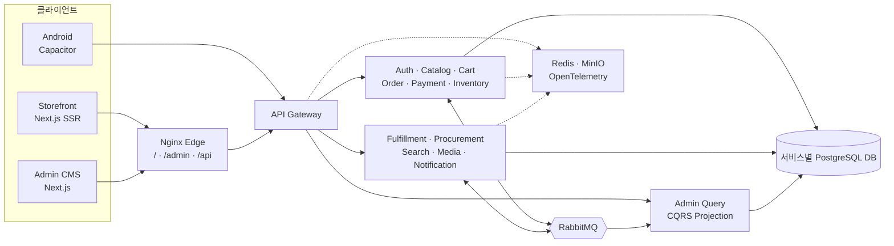

# TECHZONE

[](https://github.com/lulupang2/ecommerce/actions/workflows/ci.yml)

한국형 Tech/IT 커머스의 고객 구매 경험과 OMS/WMS 운영 업무를 함께 구현한
풀스택 포트폴리오입니다. 상품 탐색부터 결제·재고 예약·출고·배송·반품·환불,
관리자 projection까지 하나의 주문 흐름으로 연결합니다.

## 프로젝트에서 해결한 문제

- 고객은 SSR 스토어와 Capacitor Android 앱에서 같은 상품·주문 경험을 사용합니다.
- 운영자는 한국어 관리자 CMS에서 상품, 주문, 배송, 반품, 재고, 발주와 권한을 처리합니다.
- 서비스는 DB를 직접 공유하지 않고 이벤트와 공개 계약으로만 협업합니다.
- 메시지 중복·일시 장애·서비스 재시작 후에도 outbox/inbox와 멱등 키로 상태를 복구합니다.
- 한 주문의 Gateway → Order → Payment → Inventory → Fulfillment 흐름을 trace와
  correlation ID로 추적합니다.

## 핵심 사용자 흐름

| 영역 | 구현 범위 |
| --- | --- |
| 고객 스토어 | CMS 홈, 검색 자동완성, 카테고리·브랜드·가격 필터, 상품 variant, 장바구니, 쿠폰 |
| 주문 | 서버 가격 재검증, Mock 결제, 회원·비회원 주문 조회, 취소와 반품 |
| 관리자 | KPI 대시보드, 서버 기반 TanStack Table, 일괄 작업, CSV, RBAC, 감사로그 |
| OMS/WMS | 주문·결제 상태, 다중 창고, 예약·가용 재고, 입출고 원장, 배송·반품 |
| 공급망 | 공급사 품목, 발주서, 입고 처리, 미입고 수량과 안전재고 |
| 운영 | DLQ 재처리, outbox 지연, Saga 타임라인, projection rebuild, Grafana |

## 아키텍처



모노레포는 변경과 계약을 함께 추적하기 위한 저장소 전략입니다. 런타임은 API
Gateway와 12개 NestJS 도메인 서비스로 분리하며, 각 서비스가 자신의 DB,
Drizzle 스키마·migration과 seed를 소유합니다.

## 기술 스택

- Frontend: Next.js 16, React 19, TypeScript, Tailwind CSS 4, shadcn/ui,
  TanStack Table, Recharts
- Mobile: Capacitor 8, Android
- Backend: Node.js 22, NestJS 11, PostgreSQL 16, Drizzle schema/migration
- Messaging: RabbitMQ, transactional outbox/inbox, retry, DLQ, idempotency
- Security: RS256/JWKS, 회전형 refresh token, CSRF, RBAC, Redis rate limit
- Observability: OpenTelemetry, Prometheus, Tempo, Loki, Grafana
- Delivery: npm workspaces, Turborepo, Docker Compose, Kubernetes, GitHub Actions

## 5분 로컬 실행

요구 환경은 Node.js 22 이상과 Docker Desktop입니다.

```bash
git clone https://github.com/lulupang2/ecommerce.git
cd ecommerce
npm ci
npm run ms:up
```

초기 이미지 빌드와 migration·seed가 끝난 뒤 다음 주소를 사용합니다.

| 화면 | 주소 |
| --- | --- |
| 고객 스토어 | http://localhost:15173 |
| 관리자 CMS | http://localhost:15173/admin |
| API Gateway | http://localhost:18080/api |
| Grafana | http://localhost:13000 |
| RabbitMQ Management | http://localhost:15672 |
| MinIO Console | http://localhost:19001 |

개발 관리자 계정은 `admin@techzone.local` / `TechzoneAdmin123!`입니다.
Grafana는 `admin` / `techzone`을 사용합니다. 저장소의 계정과 Mock provider는
로컬 데모 전용이며 운영에서는 반드시 외부 Secret Manager 값으로 교체해야 합니다.

## 검증

```bash
npm run lint
npm run typecheck
npm run test:unit
npm run test:contract
npm run build

# Docker 스택 실행 후
npm run test:security
npm run test:integration
npm run test:storefront
npm run test:browser-e2e
npm run test:resilience

# 배포 산출물
npm run --silent k8s:render > techzone-k8s.json
npm run k8s:validate -- techzone-k8s.json
npm run build:mobile
npm run mobile:sync
```

CI는 정적 검사와 계약 → Docker 통합·보안·E2E·장애 복구 → Kubernetes 46개
리소스와 Android debug APK 순서로 검증합니다. 같은 event ID와
`Idempotency-Key`가 반복되어도 주문·결제·재고가 한 번만 변경되는지,
RabbitMQ 중단 후 미발행 outbox가 복구되는지도 자동 테스트합니다.

## 설계 문서

- [포트폴리오 데모 시나리오](docs/DEMO.md)
- [아키텍처와 주문 Saga](docs/ARCHITECTURE.md)
- [기술 의사결정과 트레이드오프](docs/DECISIONS.md)
- [DB 소유권과 핵심 불변식](docs/DATA_MODEL.md)
- [보안·이벤트 신뢰성·관측성](docs/RELIABILITY.md)
- [실행·복구 Runbook](docs/RUNBOOK.md)
- [모노레포 경계](docs/monorepo.md)
- [PRD](docs/PRD.md) · [SSOT](docs/SSOT.md)

## 의도적으로 제외한 범위

실제 PG·택배·SMS 연동은 provider adapter의 Mock 구현으로 대체했습니다.
트래픽 기반 용량 산정과 클라우드 관리형 서비스 배포는 별도 운영 환경이 필요한
영역이므로, 이 저장소는 계약·복구 전략과 Docker/Kubernetes 배포 기준까지
검증하는 데 초점을 맞춥니다.
