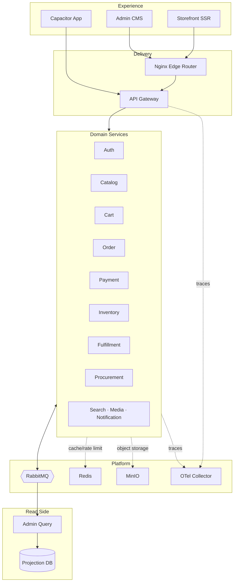
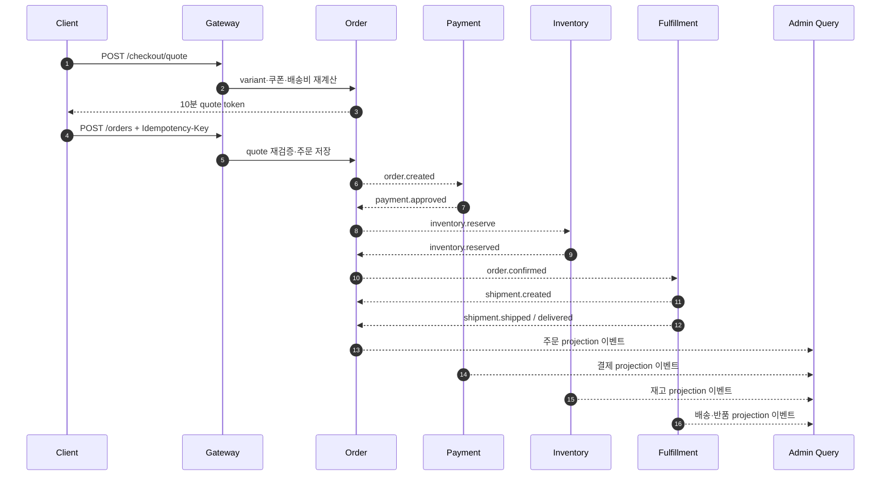

# TECHZONE 아키텍처

## 시스템 경계

Edge는 `/admin/*`을 관리자 앱, `/api/*`를 Gateway, 나머지를 고객 스토어로
전달합니다. 모노레포는 계약·UI·인프라 변경을 한 커밋에서 추적하지만, 배포
단위와 데이터 소유권은 서비스별로 유지합니다.

## 서비스 책임

| 서비스 | 책임 | 소유 데이터 |
| --- | --- | --- |
| Auth | 로그인, JWKS, refresh token family, RBAC | 사용자·역할·권한·토큰 |
| Catalog | 상품·variant·CMS·리뷰·Q&A·찜 | 상품·진열·콘텐츠 |
| Cart | 사용자별 variant 장바구니 | 수량·가격 snapshot |
| Order | quote, 쿠폰, 주문, Saga 상태 | 주문·주문 품목·주소 snapshot |
| Payment | 승인·취소·환불 provider adapter | 결제·transaction |
| Inventory | 창고별 수량, 예약, 이동, 원장 | balance·movement·serial |
| Fulfillment | 출고, 송장, 추적, 반품 | shipment·return |
| Procurement | 공급사, 발주, 입고 | supplier·purchase order |
| Search/Media/Notification | 검색, 이미지, 알림 지원 | 서비스별 지원 데이터 |
| Admin Query | 통합 목록, KPI, 알림, 감사로그 | event projection |

다른 서비스의 테이블이나 Drizzle schema를 import하지 않습니다.
`@techzone/contracts`가 HTTP DTO와 `schemaVersion: 1` 이벤트 envelope의
SSOT이며, Gateway OpenAPI와 프론트 API client는 이 계약에서 생성합니다.

## 주문·배송 Saga

각 쓰기 서비스는 도메인 변경과 outbox 기록을 같은 PostgreSQL transaction에
커밋합니다. publisher confirm 이후에만 발행 완료로 표시하며, 소비자는 event
ID를 inbox에 기록해 중복 전달을 무시합니다. 실패 메시지는 1초, 5초, 30초,
2분, 10분 순으로 재시도한 뒤 DLQ로 이동합니다.

## 반품·환불

배송 완료 후 7일 이내 반품을 요청할 수 있습니다. Fulfillment가 승인·입고·검수
상태를 관리하고, 환불 가능 상태가 되면 Payment에 환불을 요청합니다. 결제
transaction은 append-only로 남고, Order는 환불 금액과 Saga 결과를 반영합니다.
관리자는 주문 타임라인에서 단계별 실패·보상 결과를 확인합니다.

## Admin Query와 CQRS

- 쓰기 서비스 DB를 실시간 cross-database join하지 않습니다.
- 이벤트로 주문·상품·재고·배송·반품·발주 projection과 일별 KPI를 갱신합니다.
- `processed_events.event_id`로 동일 이벤트의 중복 반영을 막습니다.
- 목록·검색·차트는 projection DB만 읽어 관리자 응답의 fan-out을 제거합니다.
- projection 불일치 시 감사 사유를 남기고 `POST /admin/rebuild`로 재구성합니다.

이 선택은 관리자 데이터가 원본보다 잠시 늦을 수 있는 eventual consistency를
허용하는 대신, 운영 조회가 여러 쓰기 서비스의 동시 가용성에 의존하지 않도록
합니다.

## 웹과 앱

웹은 Next.js standalone SSR로 동적 metadata, canonical, sitemap과 상품
JSON-LD를 제공합니다. `CAPACITOR_BUILD=1`에서는 같은 화면 컴포넌트를 정적
export하고 Android 앱 셸에 동기화합니다. 관리자 앱은 별도 Next.js 배포 단위라
모바일 번들에 포함되지 않습니다.

인증은 웹에서 HttpOnly 쿠키와 CSRF 토큰, Capacitor에서 Bearer access/refresh
token을 사용합니다. 공개 URL은 같아도 저장 방식과 갱신 adapter는 플랫폼별로
분리합니다.

## 관측성과 배포

HTTP·RabbitMQ·PostgreSQL 호출의 trace context를 유지하고 Collector를 통해
Tempo, Prometheus, Loki로 전송합니다. Grafana에서는 RED 지표, DB pool,
outbox 지연, DLQ, Saga 실패와 주문 성공률을 함께 확인합니다.

Kubernetes 렌더러는 13개 NestJS 앱의 Deployment·Service·PDB, 주요 쓰기
서비스의 HPA, ConfigMap·RBAC·migration Job을 포함한 46개 리소스를 생성합니다.
rolling update는 `maxUnavailable: 0`, `maxSurge: 1`을 기본으로 하며 migration
Job 성공 후 애플리케이션을 배포합니다.
