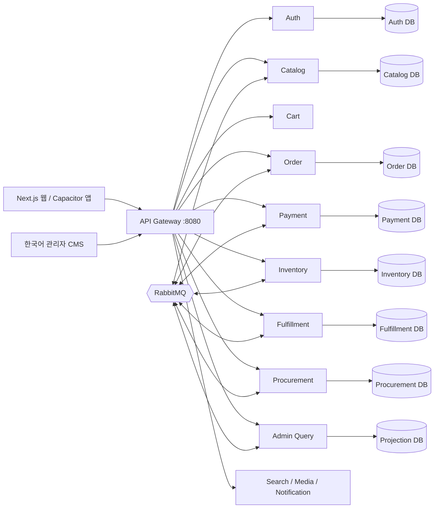
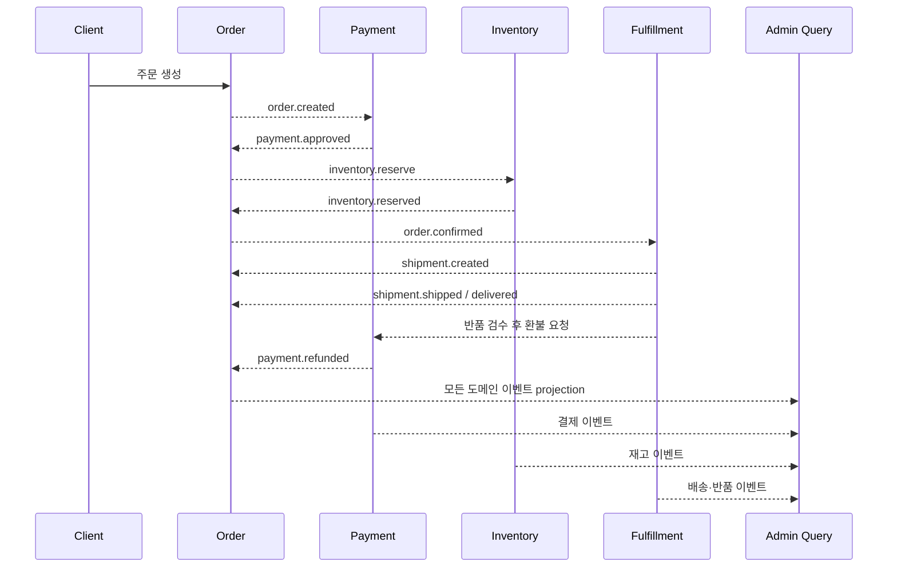

# TECHZONE 아키텍처

## 구성

모노레포는 계약·UI·인프라 변경을 한 커밋으로 추적하기 위한 저장소 전략이다. 런타임과 DB 소유권은 서비스별로 분리되어 MSA 경계를 유지한다.

## 주문·출고·반품 흐름

## Admin Query

- 쓰기 모델의 DB를 조인하지 않고 이벤트로 주문·상품·재고·배송·반품·발주 projection을 갱신한다.
- `processed_events.event_id`로 중복 이벤트를 무시한다.
- `POST /admin/rebuild`는 내부 API를 읽어 projection을 완전히 재생성한다.
- KPI와 목록 조회는 projection DB에서 처리하므로 운영 화면이 원본 서비스의 가용성과 복잡한 fan-out에 직접 의존하지 않는다.

## 보안과 신뢰성

- JWT에는 역할과 권한을 포함하며 API마다 역할과 세부 permission을 함께 검사한다.
- 내부 rebuild API는 `x-internal-key`로 외부 요청과 분리한다.
- 상태 전이는 허용된 방향만 지원하며 재고·환불은 DB 제약과 조건부 갱신으로 불변식을 지킨다.
- 관리자 mutation과 projection rebuild는 감사로그에 행위자·대상·사유를 기록한다.
- 다음 운영 단계의 확장점은 transactional outbox, DLQ/재시도 정책, OpenTelemetry, secret manager다.
