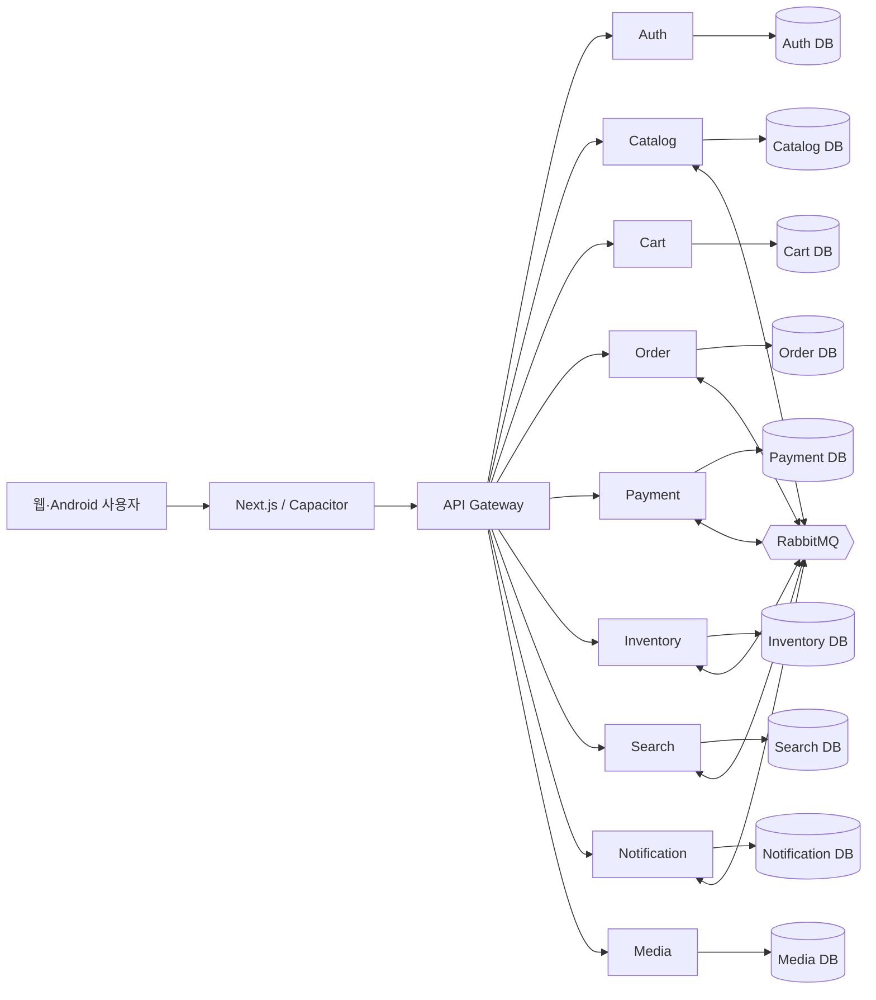
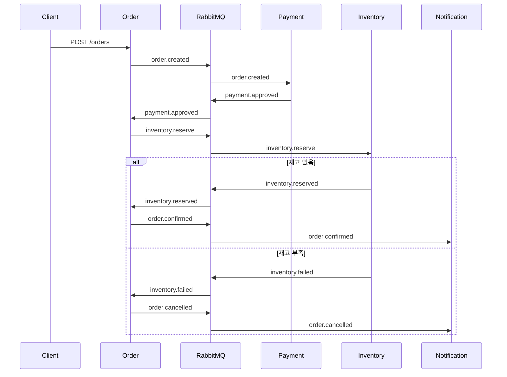

# TECHZONE 아키텍처

## 시스템 구성

## 저장소 전략

TECHZONE은 모노레포다. 개인 포트폴리오에서 프론트엔드, 계약, 인프라 변경을 한 커밋으로 추적하고 로컬 환경을 한 번에 재현하기 위해서다. 런타임은 서비스별 프로세스·데이터베이스·컨테이너로 분리하므로 MSA 경계는 유지된다. 규모가 커지면 독립 배포 빈도와 팀 소유권을 기준으로 저장소 분리를 검토한다.

## 주문 Saga

## 현재 구현과 확장 지점

- Gateway는 단순 프록시다. 공개 배포 전 JWT 검증, rate limiting, correlation ID를 추가한다.
- Payment는 자동 Mock 승인이다. 실제 연동 시 승인 API·웹훅 검증·멱등 키를 추가한다.
- Search는 Catalog 검색을 중계한다. 데이터 규모가 커지면 OpenSearch projection으로 교체한다.
- Media는 업로드 URL 메타데이터만 저장한다. S3/MinIO signed URL로 교체한다.
- 이벤트 전달은 RabbitMQ topic exchange를 사용한다. 운영 단계에서는 outbox와 consumer inbox를 추가한다.
- DB 접근은 Drizzle ORM의 서비스별 schema/query를 사용한다. 현재 모든 서비스의 애플리케이션 CRUD가 Drizzle로 전환되어 있다.
- 로그·메트릭·트레이싱은 OpenTelemetry를 공통 HTTP 계층에 도입한다.

## 실패 처리 원칙

- 동기 API는 명확한 4xx/5xx와 오류 코드를 반환한다.
- 이벤트 소비자는 재시도 후 DLQ로 이동할 수 있어야 한다.
- 주문 상태 전이는 단방향으로 제한하고 이벤트 중복 수신에도 동일한 결과를 보장해야 한다.
- DB 쓰기와 이벤트 발행의 불일치는 transactional outbox 도입으로 해소한다.
