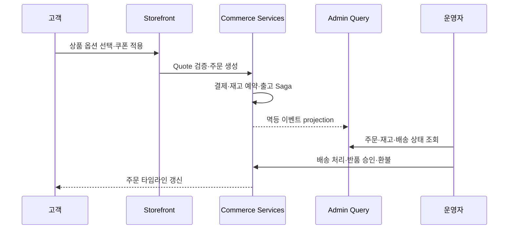

# TECHZONE Case Study

## 프로젝트 한 줄 요약

TECHZONE은 상품을 예쁘게 보여주는 쇼핑몰 화면에 그치지 않고, 주문이 결제·재고
예약·출고·배송·반품·환불과 관리자 지표로 이어지는 운영 시스템을 한 저장소에서
재현한 테크 커머스 포트폴리오입니다.

## 문제 정의

커머스 포트폴리오는 고객 화면만 구현하면 실제 운영에서 어려운 부분이 보이지
않습니다. 이 프로젝트는 다음 질문에 답하는 것을 목표로 했습니다.

1. 상품 옵션별 가격과 재고를 어떻게 일관되게 관리할 것인가?
2. 주문과 결제, 재고가 서로 다른 서비스에 있을 때 이벤트를 어떻게 잃지 않을 것인가?
3. 여러 서비스의 데이터를 관리자 대시보드에서 어떻게 안정적으로 조회할 것인가?
4. SSR 웹과 Android 앱을 별도 제품으로 제공하면서 UI 중복을 어떻게 줄일 것인가?
5. 장애가 발생해도 주문을 중복 처리하지 않고 어떻게 복구할 것인가?

## 핵심 설계와 결과

### 1. Product가 아닌 Variant를 판매 단위로 사용

Product는 이름·설명·진열을 담당하고 Variant는 SKU·모델번호·바코드·옵션·가격을
담당합니다. 장바구니, 주문 snapshot, 재고 balance·movement·reservation,
시리얼번호가 모두 Variant를 참조합니다.

이 구조로 색상이나 용량이 다른 옵션의 가격과 창고 재고를 독립적으로 관리하고,
고객이 선택한 SKU와 실제 출고 SKU가 달라지는 문제를 방지했습니다. 주문 전
`checkout/quote`가 최신 가격, 쿠폰, 배송비와 가용 재고를 서버에서 다시
계산합니다.

### 2. Transactional Outbox로 DB와 이벤트의 dual-write 해소

주문 저장 직후 프로세스가 종료되면 DB에는 주문이 있지만 RabbitMQ 이벤트는
없을 수 있습니다. 쓰기 서비스는 도메인 변경과 `outbox_events`를 같은
PostgreSQL transaction에 기록합니다. 별도 publisher가 RabbitMQ confirm을
받은 뒤에만 발행 완료로 표시합니다.

소비자는 `inbox_events.event_id`로 중복 전달을 제거하고, command API는
`Idempotency-Key`로 재시도 중복을 막습니다. CI의 resilience 테스트는
RabbitMQ를 중단한 상태에서 주문을 커밋한 뒤 재기동하여 Saga가 복구되는지
검증합니다.

### 3. Admin Query Projection으로 운영 조회 분리

관리자 대시보드가 주문·결제·재고·배송 DB를 직접 조인하거나 여러 API를 동시에
호출하면 가장 느린 서비스에 전체 화면이 종속됩니다. Admin Query가 도메인
이벤트를 소비해 목록, KPI, 운영 알림을 위한 읽기 모델을 유지하도록 분리했습니다.

TanStack Table의 검색·정렬·필터·페이지네이션은 읽기 모델을 대상으로 서버에서
처리합니다. Eventual consistency 비용은 처리된 event ID, 지연 알림, 원본 합계
검증과 projection rebuild 명령으로 관리합니다.

### 4. Next.js SSR과 Capacitor 정적 앱 셸을 함께 제공

웹은 상품 동적 URL, metadata, canonical, sitemap과 JSON-LD가 필요한 Next.js
standalone SSR로 빌드합니다. Android는 `CAPACITOR_BUILD=1`에서 같은 고객 화면을
정적 export하여 사용합니다. 라우팅과 인증 저장 adapter만 플랫폼별로 분리하고,
관리자 Next.js 앱은 모바일 번들에서 제외했습니다.

React Native보다 네이티브 중심 UX에는 제약이 있지만, 현재 범위의 상품 탐색과
구매 흐름에서는 한 팀이 웹과 앱을 일관되게 유지하는 비용이 더 중요하다고
판단했습니다.

### 5. 운영 실패를 제품 화면과 CI에서 확인

OpenTelemetry trace context를 HTTP·RabbitMQ·PostgreSQL 흐름에 연결하고,
Prometheus·Tempo·Loki·Grafana로 요청률, 오류율, p95, outbox 지연, DLQ와 Saga
실패를 확인합니다. 관리자 시스템 화면에서도 DLQ 재처리, 지연 outbox와 실패
Saga를 다루며 모든 운영 명령은 감사로그를 남깁니다.

배포는 공개 포트를 Caddy로 제한하고, 불변 릴리스·배포 전 DB 백업·HTTPS
스모크 테스트·실패 시 직전 릴리스 복구를 제공합니다.

## 검증 가능한 사용자 흐름

자동 검증은 다음을 포함합니다.

- 회원·비회원 구매, 가격 변경, 쿠폰 한도와 주문 소유권
- 관리자 RBAC, 상품·주문·재고·배송·반품 운영
- 중복 command와 event의 단일 처리
- 주문→결제→재고 예약→출고→배송 및 반품→환불
- RabbitMQ 장애 후 outbox 재발행과 Saga 복구
- Next.js SSR, Capacitor 정적 빌드와 Android debug APK
- Docker Compose healthcheck와 Kubernetes 리소스 계약

## 의도적인 제약과 다음 확장

- 실제 PG·택배·SMS 계약이 필요하므로 provider port 뒤의 Mock adapter를
  사용합니다. 운영 전환 시 webhook 서명, reconciliation과 sandbox E2E가
  필요합니다.
- 단일 지역·KRW·부가세 포함 정책에 집중했습니다. 다중 통화와 국가별 세금은
  별도 pricing/tax 경계가 필요합니다.
- 방문 행동 분석과 개인화 추천은 운영 주문 KPI 범위에서 제외했습니다.
- Capacitor는 고성능 네이티브 상호작용보다 웹과 앱의 화면 공유에 최적화된
  선택입니다.

## 더 읽기

- [제품 요구사항](PRD.md)
- [SSOT와 데이터 불변식](SSOT.md)
- [시스템 아키텍처](ARCHITECTURE.md)
- [데이터 모델](DATA_MODEL.md)
- [기술 의사결정](DECISIONS.md)
- [신뢰성·보안](RELIABILITY.md)
- [시연 시나리오](DEMO.md)
- [실행·복구 Runbook](RUNBOOK.md)
- [공개 데모 배포](DEPLOYMENT.md)
