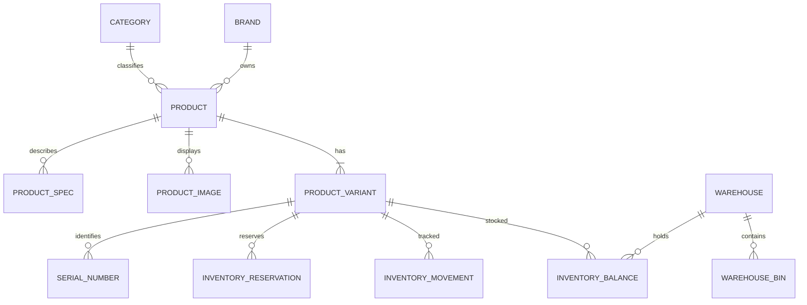
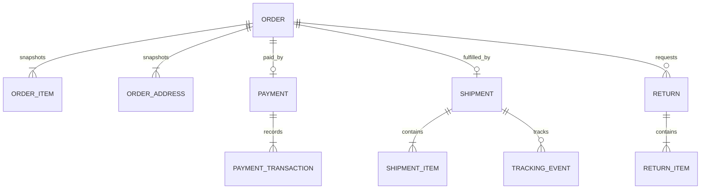

# TECHZONE 데이터 모델

서비스는 각자 PostgreSQL DB를 소유한다. 다른 서비스 ID는 논리 참조로만 보관하며 교차 DB 외래키를 만들지 않는다.

## 서비스별 모델

| DB | 주요 테이블 |
| --- | --- |
| Auth | `users`, `roles`, `permissions`, `user_roles`, `role_permissions` |
| Catalog | `brands`, `categories`, `products`, `product_variants`, `product_images`, `product_specs`, `reviews` |
| Orders | `orders`, `order_items`, `order_addresses` |
| Payments | `payments`, `payment_transactions` |
| Inventory | `warehouses`, `warehouse_bins`, `inventory_balances`, `inventory_movements`, `inventory_reservations`, `serial_numbers`, `stock_alert_rules` |
| Fulfillment | `shipments`, `shipment_items`, `tracking_events`, `returns`, `return_items` |
| Procurement | `suppliers`, `supplier_products`, `purchase_orders`, `purchase_order_items`, `goods_receipts`, `goods_receipt_items` |
| Admin | 도메인별 projection, `daily_kpis`, `operational_alerts`, `audit_logs`, `processed_events` |

## 상품과 재고

상품의 노출 단위는 product, 판매·가격·재고 단위는 variant다. `available_qty`, `reserved_qty`, `damaged_qty`, `incoming_qty`는 분리한다. 주문 예약은 여러 활성 출고 창고에 분할될 수 있으며 `(order_id, warehouse_id, variant_id)`로 유일하다. 예약·해제는 주문 전체를 단일 transaction으로 처리하고 `reserved → confirmed → committed` 또는 `released` 상태 이력을 남긴다. 조정·입고·예약·해제·출고·이동은 movement 원장을 남기며 가용 수량을 음수로 만들 수 없다.

## 주문과 이행

주문, 결제, 출고 상태는 각각 독립 ENUM이다. 주문 품목은 SKU·상품명·가격·할인·세금을, 주소는 수령인·연락처·주소를 snapshot으로 보존한다. 결제 transaction은 승인·취소·환불의 append-only 기록이다.

## 공급과 입고

공급사는 variant별 공급 SKU·원가·리드타임을 가진다. 발주서는 `draft → approved → partially_received → received`로 전이한다. 입고 확정은 goods receipt를 남기고 `inventory.received` 이벤트로 Inventory 원장을 갱신한다.

## 핵심 제약

### 스토어·CMS 확장

- Catalog: `storefront_sections`, `storefront_section_products`, `product_questions`, `product_answers`, `wishlists`
- Cart: `(user_id, variant_id)` 복합 키와 SKU·옵션·서버 단가 snapshot
- Order: `coupons`, `coupon_redemptions`, 배송비·쿠폰·결제수단·비회원 여부 snapshot
- 판매 단위는 `product_variants`이며 SKU, 모델번호, 바코드, 옵션, 정가, 판매가를 소유한다.
- coupon redemption은 `(coupon_id, owner_id)` 유일성으로 기본 1회 사용을 보장한다.
- storefront section은 게시 상태, 시작·종료 시각, 진열 순서를 만족할 때만 공개된다.

- `product_variants.sku`, `orders.order_number`, `shipments.tracking_number`, 각 업무 번호는 unique
- 수량과 금액은 0 이상, 주문·발주 품목 수량은 1 이상
- 예약량은 가용량을 초과할 수 없고 이동은 출발·도착 movement를 한 쌍으로 기록
- serial은 variant 단위 unique이며 창고·상태 이력을 가진다
- 이벤트 소비는 event ID를 `processed_events`에 먼저 기록해 멱등 처리
