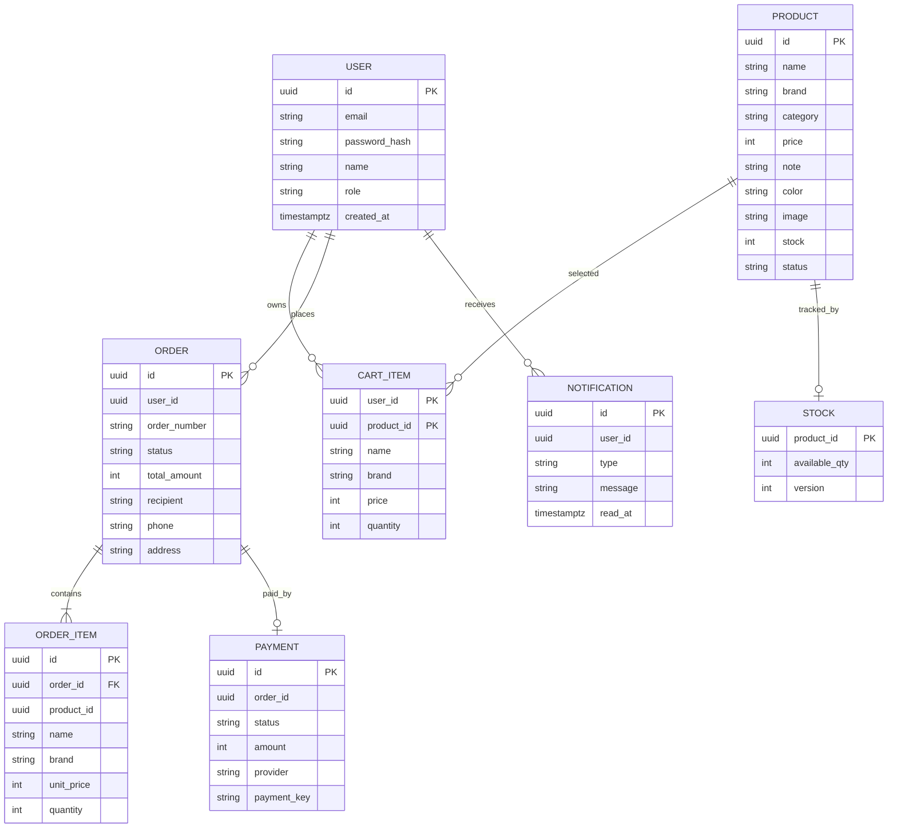

# TECHZONE 데이터 모델

각 서비스가 독립 PostgreSQL 데이터베이스를 소유한다. 다른 서비스의 ID는 참조 값으로만 보관하며 DB 외래키로 연결하지 않는다.

## 핵심 관계



## 서비스별 테이블

| DB | 테이블 | 핵심 제약 |
| --- | --- | --- |
| auth | users | `email` unique, role 기본값 `customer` |
| catalog | products | 가격·재고 정수, status 기본값 `published` |
| cart | cart_items | `(user_id, product_id)` PK, quantity > 0 |
| orders | orders | `order_number` unique, 상태 기본 `pending` |
| orders | order_items | 주문 당시 상품명·브랜드·가격 snapshot 저장 |
| payments | payments | `order_id` unique |
| inventory | stock | `product_id` PK, 조건부 UPDATE로 재고 차감 |
| notifications | notifications | 사용자별 생성 시간 역순 조회 |
| search | search_events | event ID PK로 상품 이벤트 중복 방지 |
| media | media_assets | 객체 키와 공개 URL 메타데이터 저장 |

## 주문 상태

## 상품·재고 운영 설계 점검

- `products.stock`은 상품 등록 시점의 초기/표시 재고 스냅샷입니다.
- 실제 판매 가능 수량과 동시성 제어는 `stock.available_qty`가 담당합니다.
- `stock.version`은 예약·관리자 수정 시 증가해 낙관적 동시성 추적에 사용합니다.
- Catalog와 Inventory는 MSA에서 서로 다른 데이터베이스를 소유하므로 물리적 FK 대신 `products.id = stock.product_id` 논리 관계와 이벤트 검증으로 연결합니다.
- 상품 상세 리치 콘텐츠는 현재 `products.note`에 HTML 문자열로 저장하며, 추후 별도 `product_contents` 테이블로 분리할 수 있습니다.
- 이미지 바이너리는 DB에 저장하지 않고 `media_assets` 메타데이터와 MinIO 객체로 분리합니다.

```text
pending -> confirmed
pending -> cancelled
```

현재 MVP는 Mock 결제 승인과 재고 예약을 하나의 비동기 흐름으로 처리한다. 실제 결제를 도입하면 `pending_payment`, `paid`, `preparing`, `shipped`, `delivered`, `refunded` 상태와 전이 규칙을 추가한다.

## 데이터 무결성 보완 계획

- 주문 생성 시 Catalog가 제공한 가격을 서버에서 다시 확인한다.
- 재고 예약에 reservation과 만료 시간을 추가한다.
- 모든 이벤트 생산 서비스에 outbox 테이블을 추가한다.
- 소비 서비스에 processed event/inbox 테이블을 추가한다.
- 개인정보가 포함된 배송 정보는 보존 기간과 암호화 정책을 적용한다.
